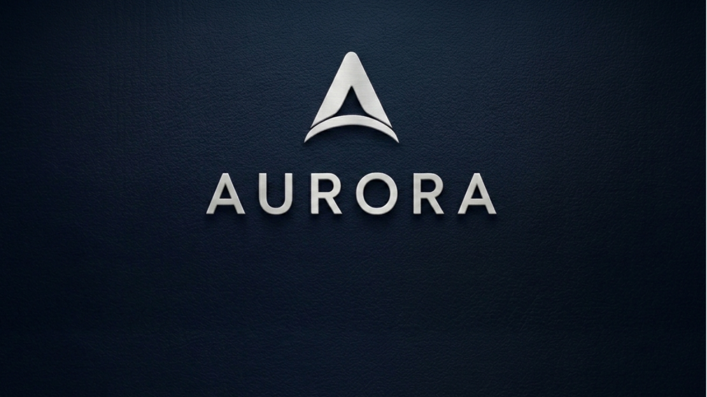

<div align="center">

  

  # 🌌 AURORA — ESP32 Vehicle Control HMI

  Professional automotive-grade web cockpit for remote operation of an ESP32 RC car
  with a live ESP32-CAM video feed.

  Industrial instrument-cluster aesthetics — no neon, no glass, just function.

  <a href="https://aurora-hmi.netlify.app"></a>
  
  
  

  <br/>

  

</div>

---

## ✨ Features

| | | |
|---|---|---|
| 📹 **Live camera** | MJPEG feed with FPS + resolution HUD, fullscreen, snapshot, canvas video recording, quality presets and auto-reconnect | |
| 🎮 **Steering wheel** | Realistic wheel with grips, spokes and horn hub — drag / touch / arrows, smooth auto-centering | |
| 🦶 **Pedals** | Accelerator (hold → drive) and brake, with configurable reverse / stop behaviour | |
| ⚙️ **Gear selector** | P / R / N / D shifter with animated lever overlay on the camera view | |
| 💡 **Lighting console** | Headlights, high beam, fog, interior, parking, brake + reverse lights | |
| 🔀 **Turn indicators** | LEFT / RIGHT / HAZARD with synchronized blink, hazard override and auto-cancel | |
| 📟 **Instrument cluster** | Analog speedometer (canvas) with glass-dome treatment and live telemetry | |
| ⚠️ **Dashboard warnings** | Seatbelt, battery, temperature, oil, ABS, WiFi, camera, motor, lights… driven by telemetry | |
| 🎛️ **Telemetry HUD** | Battery %, voltage, uptime, CPU temp, RSSI, latency, packet loss, FPS, firmware | |
| ⌨️ **Keyboard driving** | Full keyboard map for desktop use | |
| 📱 **Mobile-first** | One-handed touch layout, haptic feedback, portrait page rotation with compact HMI | |

## ⌨️ Keyboard map

| Key | Action | Key | Action |
|---|---|---|---|
| `W` / `↑` | Throttle | `A` / `D` | Steer left / right |
| `S` / `↓` | Brake | `Space` | Horn |
| `Q` / `E` | Indicators L / R | `Z` | Hazard |
| `H` | Headlights | `B` | High beam |
| `F` | Fog | `P` | Parking |
| `G` | Gear cycle | `R` | Record |
| `Esc` | ⛔ Emergency stop | | |

## 🚀 Quick start

```sh
# serve the folder (the ESP32 serves it in production too)
python3 -m http.server 8000
# open http://<host>:8000
```

## 🔌 ESP32 integration

The page talks to the ESP32 over **WebSocket** at `ws://<host>:<port>/ws` — the
same host and port the page was loaded from, unless configured otherwise.

### Page → ESP32

```json
{ "command": "forward" }
{ "command": "reverse" }        /* or stop, see brake_mode */
{ "command": "left" }           /* steering, repeated while away from centre */
{ "command": "gear", "gear": "D" }   /* P | R | N | D */
{ "command": "horn" }
{ "command": "estop" }
{ "command": "headlights", "value": 1 }   /* highbeam, parkinglights,
                                              foglights, interiorlight,
                                              brakelight, reverselight */
{ "type": "indicator", "left": true, "right": false, "hazard": false, "phase": 1 }
{ "type": "quality", "value": "800x600|20" }   /* or low | med | high | 0 */
{ "type": "ping", "t": 1234.5 }
{ "type": "hello", "app": "aurora", "version": "1.0.0" }
```

### ESP32 → Page

```json
{ "type": "pong", "t": 1234.5 }
{ "type": "config", "brake_mode": "reverse", "quality": "800x600|20" }
{ "type": "ack", "ack": true }
{ "type": "telemetry", "battery_pct": 82, "voltage": 7.4, "uptime": 1542,
  "motor_state": "idle", "cpu_temp": 51, "rssi": -64, "latency": 22,
  "pkt_loss": 0, "fps": 15, "cmd_resp": 3, "firmware": "1.3.0",
  "gear": "D", "speed": 12, "rpm": 2400,
  "warnings": { "seatbelt": false, "oil": false, "abs": false } }
```

Telemetry may be partial — missing keys are ignored.

### 📷 Camera

| Feed | `<host>/stream?q=800x600|20` — MJPEG shown in an ``; `?q=0` disables |
|---|---|
| Snapshot | Browser re-fetches the feed with a `download` attribute |
| Record | Canvas-captured `.webm` — zero payload to the ESP |

### ⚙️ Configuration

Defaults live at the top of `js/app.js`:

```js
wsPort: null,          // null → use page port; set e.g. 81 for ws://host:81/ws
streamPath: "/stream",
quality: "800x600|20",
brakeMode: "reverse",  // "reverse" | "stop" (backend config overrides)
```

## 🗂️ Project layout

```
├── index.html          cockpit markup
├── css/style.css       industrial HMI design system
├── js/app.js           single-file app (comms, gauges, inputs, camera, telemetry)
├── assets/             branding & loading screen art
└── netlify.toml        static-site deploy config
```

## 📝 Note

No WiFi credentials are stored client-side — the ESP32 provides the `hostapd`
or router connection. Best experienced in Chrome / Edge (MediaRecorder and
pointer events).

---

<div align="center">

  Built with 💙 for the open road · **[Try the live demo →](https://aurora-hmi.netlify.app)**

</div>
